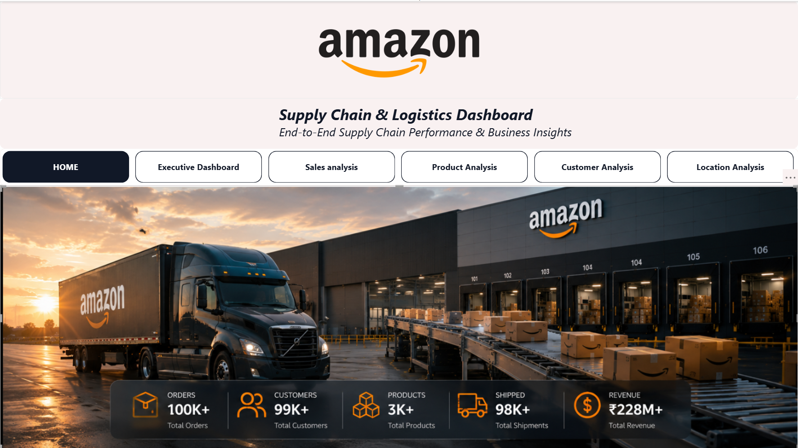
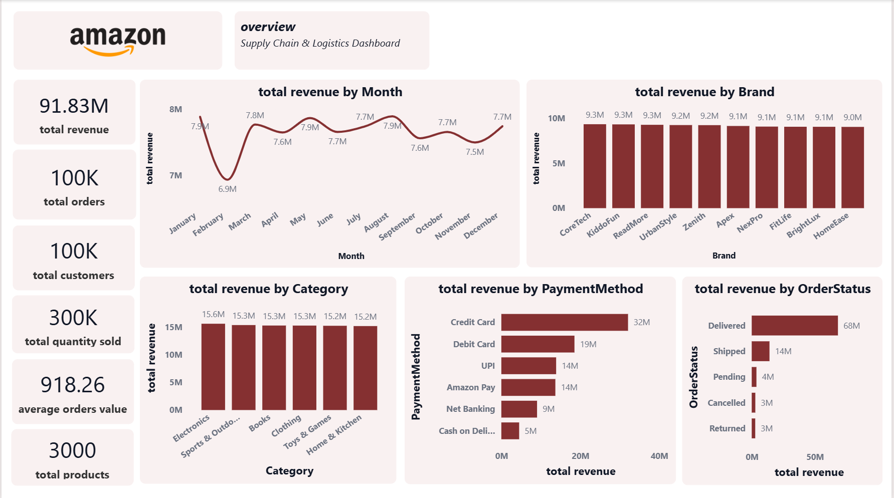
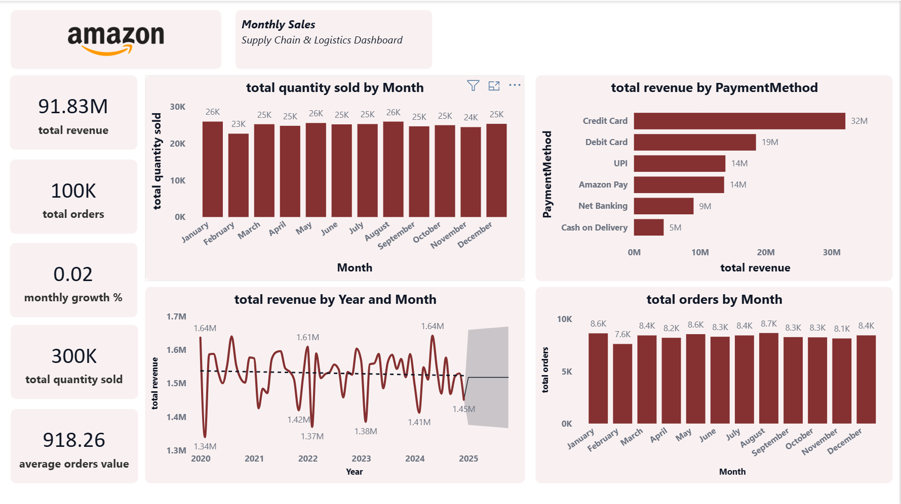
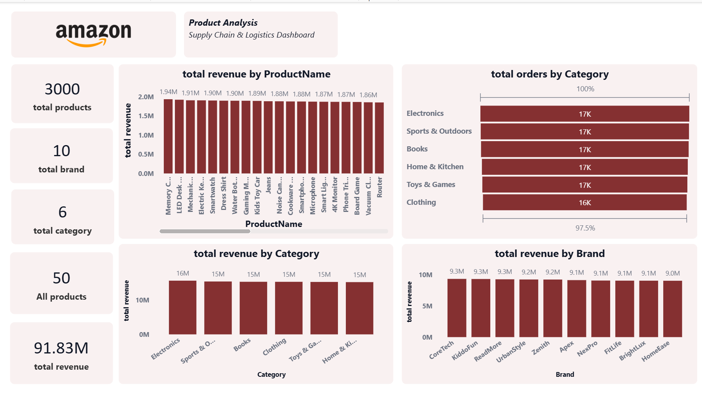
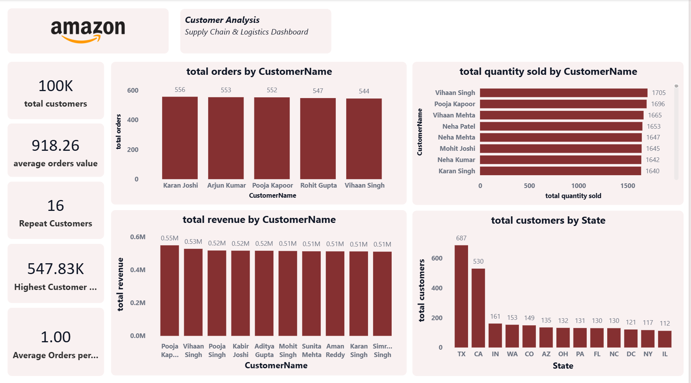
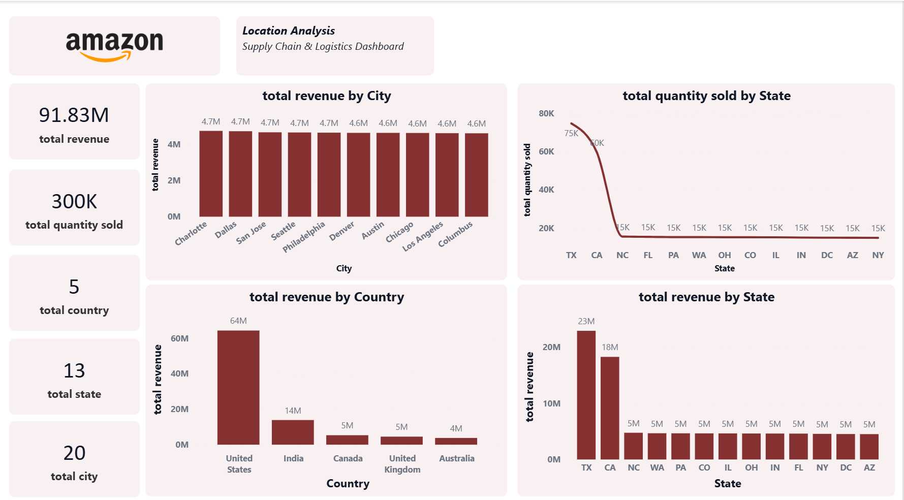

# 📦 Amazon Sales Data Warehouse & Power BI Analytics

## 📖 Project Overview

The **Amazon Sales Data Warehouse & Power BI Analytics** project is an end-to-end Data Analytics solution developed using **MySQL** and **Power BI**.

The project transforms raw Amazon sales data into a structured **Star Schema Data Warehouse**, performs data validation and business analysis using SQL, and presents actionable insights through interactive Power BI dashboards.

This project demonstrates the complete analytics workflow including **database design, ETL, SQL analytics, data modeling, DAX measures, and dashboard development**.

---

# 🎯 Project Objectives

The primary objectives of this project are:

- Design a Star Schema Data Warehouse
- Build ETL scripts to load clean data into dimension and fact tables
- Perform business analysis using SQL
- Implement advanced SQL concepts
- Develop interactive Power BI dashboards
- Generate business insights for decision making

---

# 🛠 Tech Stack

| Technology | Purpose |
|------------|----------|
| MySQL | Database & Data Warehouse |
| SQL | Data Cleaning & Business Analysis |
| Power BI | Dashboard & Data Visualization |
| DAX | Business Calculations |
| Git | Version Control |
| GitHub | Project Repository |

---

# 📂 Project Structure

```
Amazon-Sales-Data-Warehouse/

│
├── data/
│   ├── raw/
│   └── cleaned/
│
├── sql/
│   ├── 01_create_database.sql
│   ├── 02_create_raw_table.sql
│   ├── 03_create_dimension_tables.sql
│   ├── 04_create_fact_tables.sql
│   ├── 05_load_dimension_tables.sql
│   ├── 06_load_fact_tables.sql
│   ├── 07_create_foreign_keys.sql
│   ├── 08_data_validation.sql
│   ├── 09_business_queries.sql
│   ├── 10_create_views.sql
│   ├── 11_create_stored_procedures.sql
│   ├── 12_case_when.sql
│   ├── 13_conditional_functions.sql
│   ├── 14_subqueries.sql
│   ├── 15_cte.sql
│   └── 16_window_functions.sql
│
├── powerbi/
│   └── Amazon_Sales_Dashboard.pbix
│
├── screenshots/
│
├── diagrams/
│
└── README.md
```
---

# 📊 Dataset Information

This project uses an Amazon Sales dataset to simulate a real-world e-commerce sales environment.

### Dataset Summary

| Attribute | Details |
|-----------|----------|
| Dataset Type | Amazon Sales Data |
| Total Records | 100,000 |
| Customers | 99,984 |
| Products | 3,000 |
| Sellers | 1,999 |
| Orders | 100,000 |
| Order Details | 100,000 |

The dataset contains information related to:

- Customer Details
- Product Information
- Order Transactions
- Payment Methods
- Order Status
- Sales Amount
- Discounts
- Taxes
- Shipping Cost
- Customer Location

---

# 🏗 Database Schema

The database is designed using a **Star Schema**, which is commonly used in Data Warehousing for reporting and analytics.

## Dimension Tables

- Customers
- Products
- Sellers

## Fact Tables

- Orders
- OrderDetails

The dimension tables store descriptive information, while the fact tables store transactional sales data.

---

# 🔄 ETL Process

The project follows a structured ETL (Extract, Transform, Load) workflow.

### Step 1 – Extract

- Imported raw Amazon sales data into the `amazon_sales_raw` table.

### Step 2 – Transform

- Removed duplicate records.
- Created unique customer records.
- Created unique product records.
- Created seller dimension.
- Generated surrogate keys.
- Organized data into dimension and fact tables.

### Step 3 – Load

Loaded transformed data into:

- Customers
- Products
- Sellers
- Orders
- OrderDetails

### Step 4 – Data Validation

Performed validation checks to verify:

- Total Customers
- Total Products
- Total Sellers
- Total Orders
- Total Order Details

---

# 💾 SQL Files Description

The SQL scripts are organized into separate modules for better readability and maintainability.

| File | Description |
|------|-------------|
| 01_create_database.sql | Create database |
| 02_create_raw_table.sql | Create raw staging table |
| 03_create_dimension_tables.sql | Create dimension tables |
| 04_create_fact_tables.sql | Create fact tables |
| 05_load_dimension_tables.sql | Load dimension tables |
| 06_load_fact_tables.sql | Load fact tables |
| 07_create_foreign_keys.sql | Create relationships |
| 08_data_validation.sql | Validate loaded data |
| 09_business_queries.sql | Business analysis queries |
| 10_create_views.sql | Business reporting views |
| 11_create_stored_procedures.sql | Stored procedures |
| 12_case_when.sql | CASE WHEN examples |
| 13_conditional_functions.sql | IF(), IFNULL(), COALESCE(), NULLIF() |
| 14_subqueries.sql | Scalar, Correlated & Nested Subqueries |
| 15_cte.sql | Common Table Expressions (CTE) |
| 16_window_functions.sql | Ranking & Analytical Window Functions |

---

# 🧠 SQL Concepts Covered

This project demonstrates a wide range of SQL concepts used in real-world analytics projects.

## Database Design

- Database Creation
- Star Schema
- Dimension Tables
- Fact Tables
- Primary Keys
- Foreign Keys

## Data Warehousing

- ETL Process
- Data Validation
- Data Modeling

## SQL Fundamentals

- SELECT
- WHERE
- ORDER BY
- GROUP BY
- HAVING
- Aggregate Functions

## SQL Joins

- INNER JOIN
- Multi-table JOIN

## Advanced SQL

- CASE WHEN
- Conditional Functions
- Views
- Stored Procedures
- Subqueries
- Common Table Expressions (CTE)
- Window Functions

---

# 📈 Business Analysis

More than **40 business-oriented SQL queries** were developed to answer real business questions.

The analysis includes:

- Revenue Analysis
- Product Analysis
- Customer Analysis
- Sales Analysis
- Location Analysis
- Monthly Performance Analysis
- Category Analysis
- Brand Analysis
- Customer Lifetime Value (CLV)
- Repeat Customer Analysis

---

# 📊 Power BI Dashboard

Interactive dashboards were developed in **Power BI** to transform raw sales data into meaningful business insights. The dashboards enable users to monitor KPIs, analyze sales performance, identify top-performing products, evaluate customer behavior, and explore sales trends across different locations.

The dashboard is fully interactive and includes slicers, filters, KPI cards, and multiple visualizations to support business decision-making.

---

# 📑 Dashboard Pages

## 📌 Dashboard 1 – Executive Dashboard

**Purpose**

Provides a high-level overview of overall business performance.

### KPIs

- Total Revenue
- Total Orders
- Total Customers
- Total Products
- Total Quantity Sold
- Average Order Value

### Visualizations

- Monthly Revenue Trend
- Revenue by Category
- Revenue by Brand
- Revenue by Payment Method
- Revenue by Order Status

---

## 📌 Dashboard 2 – Sales Analysis

**Purpose**

Analyze sales performance over time and identify business trends.

### KPIs

- Monthly Revenue
- Monthly Orders
- Monthly Quantity Sold

### Visualizations

- Monthly Revenue Trend
- Monthly Order Count
- Revenue by Payment Method
- Revenue by Order Status
- Highest Sales Month
- Lowest Sales Month

---

## 📌 Dashboard 3 – Product Analysis

**Purpose**

Evaluate product performance and identify the best-selling products.

### KPIs

- Total Products
- Highest Revenue Product
- Most Sold Product

### Visualizations

- Top 10 Products
- Bottom 10 Products
- Revenue by Category
- Revenue by Brand
- Product-wise Revenue
- Product-wise Quantity Sold

---

## 📌 Dashboard 4 – Customer Analysis

**Purpose**

Understand customer purchasing behavior and identify valuable customers.

### KPIs

- Total Customers
- Repeat Customers
- Customer Lifetime Value (CLV)
- Average Order Value

### Visualizations

- Top 10 Customers
- Customer Revenue
- Customer Orders
- Customer Quantity Purchased

---

## 📌 Dashboard 5 – Location Analysis

**Purpose**

Analyze sales performance across different geographic locations.

### KPIs

- Total Countries
- Total States
- Total Cities

### Visualizations

- Revenue by Country
- Revenue by State
- Revenue by City
- Orders by State
- Quantity Sold by City
- Top 10 Cities by Revenue

---

# 📈 Dashboard Features

The dashboard includes the following interactive features:

- KPI Cards
- Interactive Slicers
- Dynamic Filtering
- Cross-Filtering
- Drill-down Analysis
- Interactive Charts
- Business KPIs
- Trend Analysis
- Category Analysis
- Customer Analysis
- Product Analysis
- Geographic Analysis

---

# 📸 Dashboard Preview
The following screenshots showcase the interactive Power BI dashboards developed for business analysis and decision-making.

## Home page 

Landing page of the Power BI report with navigation to different dashboard pages.

 

 ---

## Executive Dashboard

Provides an overview of key business KPIs including revenue, orders, customers, and products.

 

---

## Sales Analysis

Displays monthly sales trends, revenue growth, and order performance over time.

 

---

## Product Analysis

Highlights top-performing products, categories, and brands based on sales and revenue.

 


---

## Customer Analysis

Analyzes customer purchasing behavior, repeat customers, and customer lifetime value.

 

---

## Location Analysis

Shows sales distribution across countries, states, and cities.

 
